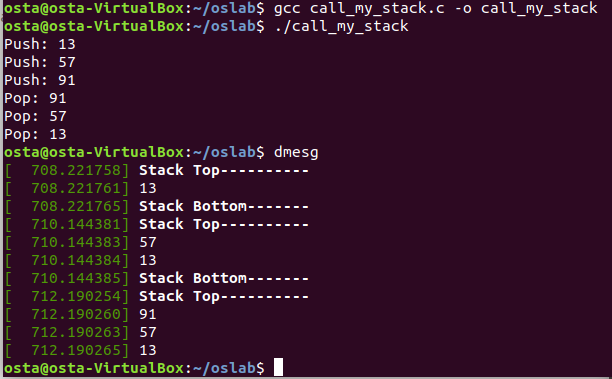
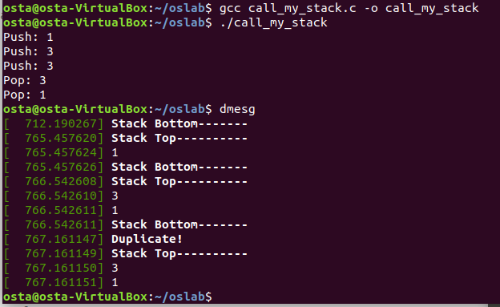

# 📕HW1 Introduction

* Content:
  * Write a system function (stack) on the Linux Kernel level that can be called using syscall.
* You can read the [1차과제_개요.pdf](https://github.com/Lin-CX/Operating-System/blob/main/hw1/1%EC%B0%A8%EA%B3%BC%EC%A0%9C_%EA%B0%9C%EC%9A%94.pdf) and download the [report](https://github.com/Lin-CX/Operating-System/blob/main/hw1/os1_2017320215_%EC%9E%84%EC%A4%80%EC%83%81/%EB%B3%B4%EA%B3%A0%EC%84%9C.docx?raw=true) to check project content.

## Some Screenshots

