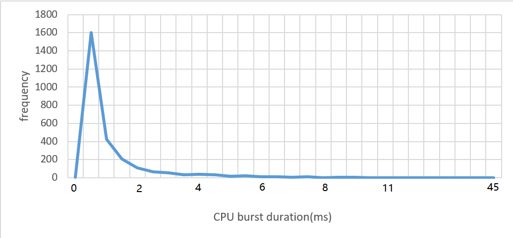

# 📕HW2 Introduction

* Content:
  * This project measure and record the CPU occupation time of the process by using kernel C function on Linux kernel mode to analyzes the process and process scheduling.

* You can read the [2차과제_개요.pdf](https://github.com/Lin-CX/Operating-System/blob/main/hw2/2%EC%B0%A8%EA%B3%BC%EC%A0%9C_%EA%B0%9C%EC%9A%94_updated.pdf) and download the [report](https://github.com/Lin-CX/Operating-System/blob/main/hw2/os2_2017320215_%EC%9E%84%EC%A4%80%EC%83%81/%EB%B3%B4%EA%B3%A0%EC%84%9C.docx?raw=true) to check project content.

## Some Screenshots

